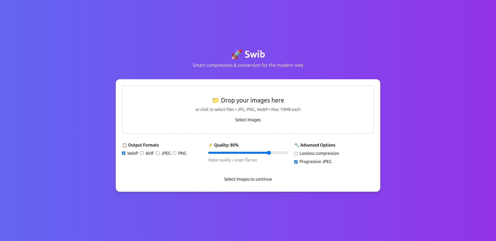

Perfect! 🎉 Let’s brand it as **Swib** and add GitHub badges for that polished open-source look.

Here’s your updated **README.md**:

---

# 🖼️ Swib – Modern Image Optimizer


  

**Swib** lets you compress, convert, and download images in multiple formats — right in your browser.
Built with **TailwindCSS**, **Preline UI**, and **Hugeicons**.

---

## ✨ Features

* 🔄 **Convert & Compress** images (JPG, PNG, WebP, AVIF\*)
* 📉 **Real file size savings** (calculated from compressed blobs)
* 📦 **Batch processing** with **ZIP download** option
* 🎉 **Confetti celebration** after successful batch processing
* 🌗 **Dark mode toggle** with local storage persistence
* 🎨 Modern UI inspired by productivity dashboards
* ⚡ 100% **client-side** – no files are uploaded to a server

> \* AVIF export depends on browser support

---

## 🛠️ Tech Stack

* [Tailwind CSS](https://tailwindcss.com/) – utility-first CSS
* [Preline UI](https://preline.co/) – modern components
* [JSZip](https://stuk.github.io/jszip/) – ZIP file creation
* [Hugeicons](https://hugeicons.com/) – clean modern icons

---

## 🚀 Getting Started

### 1. Clone the repo

```bash
git clone https://github.com/yourusername/swib.git
cd swib
```

### 2. Open the app

Simply open the HTML file in your browser:

No build step required – everything runs client-side 🎉

---

## 📂 Project Structure

```
.
├── index.html   # Main app file
├── preview.png         # Screenshot preview for GitHub
├── README.md           # Project documentation
```

## 🤝 Contributing

Contributions, issues, and feature requests are welcome!
Feel free to fork the repo and submit a PR.

---

## 📜 License

MIT License © 2025 [Swib](https://github.com/oheneadj/swib)


